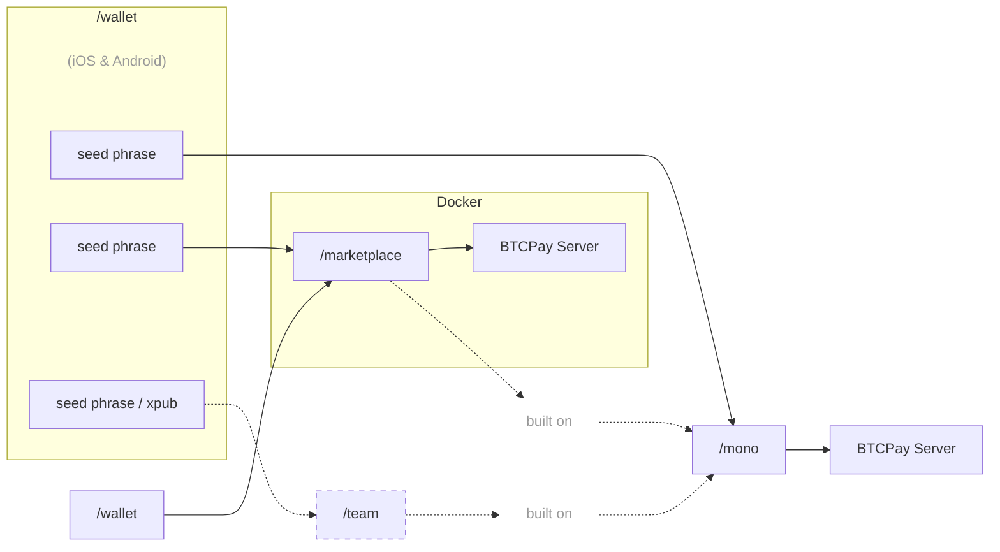

[English](https://github.com/P2Pagos/.github/blob/main/profile/README.md) | [Português](https://github.com/P2Pagos/.github/blob/main/profile/README.pt.md) | [Русский](https://github.com/P2Pagos/.github/blob/main/profile/README.ru.md) | [Français](https://github.com/P2Pagos/.github/blob/main/profile/README.fr.md) | [Italiano](https://github.com/P2Pagos/.github/blob/main/profile/README.it.md)

> Las traducciones pueden estar desactualizadas.  
> Translations may be outdated.

# P2Pagos — Infraestructura de Pagos Multi-Rail Open Source

Infraestructura de pagos open-source, modular y agnóstica por diseño para empresas y usuarios que necesitan flujos de pago multi-rail prácticos, liquidación self-custodial y movimiento de dinero cross-border más flexible.

P2Pagos está construido alrededor de **inbound rails**, **multi-rail offramp** y liquidación self-custodial. Está pensado para hacer más práctica la arquitectura de pagos entre mercados, rails, monedas y jurisdicciones, especialmente donde el acceso a pagos tradicionales es fragmentado, limitado o demasiado dependiente de un solo proveedor.

P2Pagos usa [BTCPay Server](https://github.com/btcpayserver/btcpayserver) como backend y un fork de [Aqua Wallet](https://github.com/AquaWallet/aqua-wallet) como wallet de liquidación por defecto.

[BTCPay Server](https://github.com/btcpayserver/btcpayserver) fue elegido porque es un backend API y GUI battle-tested, ampliamente adoptado y mantenido por la comunidad, con algunos rails integrados por defecto. También contribuimos activamente a su [ecosistema de core y plugins](https://github.com/search?q=involves%3Alearntheropes+%28org%3Abtcpayserver+OR+org%3Abtcpayserver-tether+OR+org%3Amempool%29&type=issues).

[Aqua Wallet](https://github.com/AquaWallet/aqua-wallet) fue elegida porque ya soporta por defecto liquidación en **btc on-chain, múltiples stablecoins (USD y BRL por ahora)**, y puede integrarse desde BTCPay Server mediante el protocolo Shamrock con un flujo de conexión por QR.

P2Pagos combina múltiples **inbound rails** — fiat local, tarjetas, P2P y cripto — con liquidación en Bitcoin y stablecoins seleccionadas. El soporte para Polygon está planificado para integrar al menos dos de los rails ya listados abajo. Para cada chain y ruta de payout soportada, el objetivo es ser transparentes sobre qué es nativo, qué es agregado por P2Pagos y qué depende de proveedores externos.

Cuando el cashout local directo todavía no es nativo, P2Pagos ofrece guías prácticas sobre wallets externas compatibles, tarjetas y herramientas de off-ramp para mejorar la usabilidad real en Latinoamérica y otras regiones soportadas. Por ejemplo, sobre todas las chains de liquidación actualmente planificadas, ya contemplamos wallets y servicios como [Belo](https://belo.app), [Revolut](https://www.revolut.com) y [Offramp](https://offramp.xyz), incluyendo caminos compatibles con tarjeta y Google Pay / Apple Pay, mientras que opciones más privacy-friendly de tarjeta y Google Pay podrían sumarse más adelante mediante trabajo planificado con la API de FixedFloat o colaboración con el emisor.

---

## Enfoque de Arquitectura de Pagos Multi-Rail

P2Pagos está diseñado alrededor de algunas decisiones prácticas:

- **Self-custodial por defecto**
- **Agnóstico en la práctica** — el rail utilizable y la ruta de liquidación importan más que la ideología
- **Multi-rail por diseño** — distintos mercados necesitan distintas formas de pagar y hacer cash out
- **Modular** — inbound rails, offramps, flujos y servicios pueden habilitarse o dejarse afuera según el caso de uso
- **Open source** — los componentes públicos siguen bajo licencia MIT, con mantenimiento y desarrollo a largo plazo sostenidos por ingresos de la oferta closed-source paga

Si un inbound rail no liquida ya en un activo soportado por el fork de Aqua Wallet, P2Pagos intenta convertir más adelante hacia el activo soportado que sea más barato y funcional para ese caso.

---

## Arquitectura

---

## Inbound Multi-Rails

| Rail | Estado | Moneda | Métodos de pago | Liquidación | Comisión | Verificación |
|------|--------|--------|-----------------|-------------|----------|--------------|
| BTC | implementado | SATS | on-chain y Lightning | Bitcoin on-chain | ninguna | ninguna |
| USDT | implementado | USD | Liquid y Polygon | USDT en Liquid y Polygon | ninguna | ninguna |
| [Peach](https://github.com/P2Pagos/mono/tree/main/rails/peach) *(p2p-api-integration)* | testing | global | cualquiera | Bitcoin on-chain | alta | ninguna |
| [RoboSats](https://github.com/P2Pagos/mono/tree/main/rails/robosats) *(p2p-api-integration)* | testing | global | cualquiera | Bitcoin on-chain | alta | ninguna |
| Mostro *(p2p-api-integration)* | evaluating | global | cualquiera | Bitcoin on-chain | alta | ninguna |
| Guardarian *(cex-api-integration)* | planned | USD, EUR, GBP, CAD, AUD, JPY, TRY, PLN, SEK | tarjetas de crédito/débito y Google/Apple Pay | Bitcoin on-chain | media | reforzada |
| Paygate *(cex-api-integration)* | planned | global | tarjetas de crédito/débito | USDT en Polygon | media | ninguna |
| DePix *(cex-api-integration)* | planned | BRL | Pix | BRL en Liquid | baja | ninguna |
| Kamipay *(cex-api-integration)* | planned | BRL | Pix | USDT en Polygon | baja | ninguna |
| MtPelerin *(cex-api-integration)* | planned | EUR y CHF | SEPA | Bitcoin on-chain o USDT en Polygon | baja | estándar |
| Bitzed *(cex-api-integration)* | planned | ZMW | móvil | Bitcoin on-chain | baja | ninguna |
| Matbea *(cex+p2p-api-integration)* | planned | RUB | Yandex Pay, Sberbank, Tinkoff, YooMoney, SBP P2P, móvil | Bitcoin on-chain | baja | ninguna |

---

## Multi-Rail Offramp

| Cashout | Estado | Moneda | Métodos de pago | Verificación |
|---------|--------|--------|-----------------|--------------|
| dLocal | early stage | LATAM / Africa / Asia & Middle East | transferencia bancaria | estándar |
| Ueno Bank | post [moonshot.md](moonshot.md) | PYG / USD | transferencia bancaria / card-popup | estándar |
| Freedomia Card | planned | USD limited settlements | tarjeta / Google Pay | ninguna |

Código de referido para un mes gratis: [Freedomia](https://www.freedomia.io/a/p2pagos)

---

## Módulos de Servicio

| Servicio | Estado | Alcance | Propósito | Default |
|---------|--------|---------|-----------|---------|
| [ip-detection](https://github.com/P2Pagos/mono/tree/main/services/ip-detection) | testing | global | geolocalización IP y detección de moneda | habilitado por defecto para detección de moneda basada en la ubicación por país de Cloudflare; los detalles se cubrirán en un post aparte sobre una vulnerabilidad de Proton VPN ignorada por el equipo de seguridad; ipinfo requiere una API key gratuita de por vida |
| [tor](https://github.com/P2Pagos/mono/tree/main/services/tor) | testing | global | reverse proxy Tor para integraciones onion y basadas en Tor | habilitado si lo consume un rail habilitado |
| [cors](https://github.com/P2Pagos/mono/tree/main/services/cors) | testing | global | reverse proxy CORS para APIs objetivo | habilitado si lo consume un rail habilitado |
| [market](https://github.com/P2Pagos/mono/tree/main/services/market) | testing | global | agregación de mercado y ofertas externas | habilitado si lo consume un rail habilitado |
| kyc-kyb | defined | worldwide | KYC / KYB | opcional, deshabilitado por defecto |
| invoicing-reporting-py | in planning | Paraguay | invoicing and reporting | opcional, deshabilitado por defecto |

---

## Repositorios Activos y Planificados

### [mono](https://github.com/P2Pagos/mono)

Repositorio MIT del orquestador single user.

Reúne inbound rails, flujos de liquidación y servicios de soporte en un solo workspace. El desarrollo activo está actualmente centrado aquí.

### [wallet](https://github.com/P2Pagos/wallet)

Un fork MIT de Aqua Flutter Wallet para P2Pagos, con una app Nuxt embebida para gestionar la configuración de /mono y conectarse a BTCPay mediante el protocolo Shamrock.

### dashboard

App basada en Nuxt, pensada para manejar flujos de pago mediante una interfaz embebida dentro de la app Flutter de /wallet.

### marketplace

Repositorio closed-source para integraciones marketplace multiusuario del repo /mono.

---

## Casos de Uso para Pagos Multi-Rail

P2Pagos está orientado a casos donde los stacks de pago estándar son demasiado limitados, demasiado frágiles o demasiado dependientes de un solo proveedor.

Casos de uso típicos:

- negocios cross-border
- empresas que necesitan pagos inbound multi-rail
- merchants que quieren liquidación en cripto con mayor alcance de pagos
- usuarios en mercados emergentes
- negocios high-risk pero legales
- builders que quieren infraestructura de pagos modular y self-hostable
- Bitcoiners y entusiastas cripto

No está pensado para presentarse como una solución universal para cualquier merchant.

---

## Estado Actual

P2Pagos sigue evolucionando.

Algunos componentes existen como integraciones funcionales, otros son parciales, experimentales o todavía están siendo ensamblados dentro del orquestador principal. Los repositorios deben leerse como trabajo activo de infraestructura, no como una suite de productos terminados.

---

## Comunidad y Contacto

- [GitHub Discussions](https://github.com/orgs/P2Pagos/discussions)
- [Grupo de Telegram](https://t.me/P2Pagos)
- [p2pagos@p2pay.to](mailto:p2pagos@p2pay.to) con PGP opcional [A1786A2CF6C5B65FDB4519F17E425F745D4EE866](https://pgp.p2pay.to)

---

### Proyecto inspirado por [**BitPagos**](https://web.archive.org/web/20141225131358/https://www.bitpagos.com/es/) en 2014
